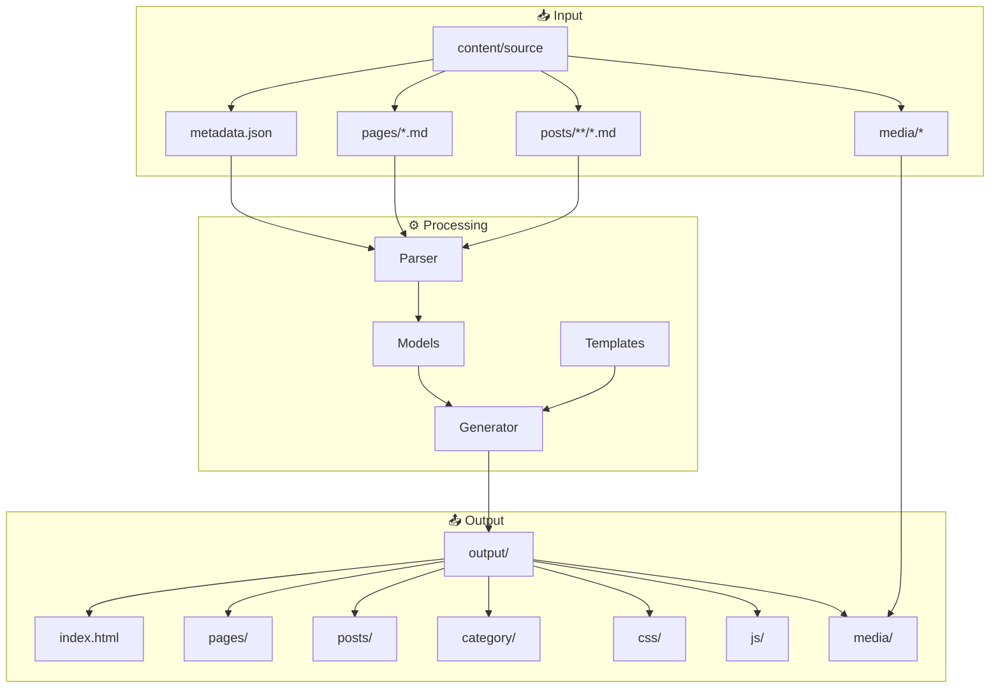

# SSG - Static Site Generator

[](https://go.dev/)
[](https://goreportcard.com/report/github.com/spagu/ssg)
[](LICENSE)
[](https://github.com/spagu/ssg/actions/workflows/ci.yml)
[](https://codecov.io/gh/spagu/ssg)
[](action.yml)
[](https://github.com/spagu/ssg/issues)
[](https://github.com/spagu/ssg/stargazers)
[](https://github.com/spagu/ssg/releases)
[](https://github.com/spagu/ssg/actions/workflows/docker.yml)
[](https://github.com/spagu/ssg/network)
[](https://securityscorecards.dev/viewer/?uri=github.com/spagu/ssg)

A fast and flexible [static site generator](https://en.wikipedia.org/wiki/Static_site_generator) built in [Go](https://go.dev/), designed for simplicity and speed.

[Website](https://github.com/spagu/ssg) | [Installation](#-installation) | [Documentation](#-usage) | [Contributing](CONTRIBUTORS.md) | [Security](SECURITY.md)

---

## 🔍 Overview

**SSG** is a static site generator written in [Go](https://go.dev/), optimized for converting WordPress exports (Markdown with YAML frontmatter) to blazing-fast static websites. With its simple architecture, multiple template engine support, and powerful asset pipelines, SSG renders a complete site in milliseconds.

### What Can You Build?

SSG is perfect for creating:

- � **Blogs** - Personal or professional blogs migrated from WordPress
- 🏢 **Corporate sites** - Fast, secure company websites
- 📚 **Documentation** - Technical docs with clean SEO URLs
- 🎨 **Portfolios** - Image galleries and creative showcases
- 📄 **Landing pages** - Marketing and product pages
- 📝 **Personal sites** - Resumes, CVs, and personal branding

### Key Capabilities

| Feature | Description |
|---------|-------------|
| **⚡ Lightning Fast** | Go-powered generation completes in milliseconds |
| **🎭 Multiple Engines** | Go templates, Pongo2 (Jinja2), Mustache, Handlebars |
| **🌐 Hugo Themes** | Download and use Hugo themes from GitHub |
| **🖼️ Image Pipeline** | WebP conversion with quality control |
| **📦 Asset Bundling** | HTML, CSS, JS minification |
| **🔄 Live Reload** | Built-in server with file watching |
| **🐳 Docker Ready** | Minimal Alpine image (~15MB) |
| **🎬 CI/CD Native** | First-class GitHub Actions support |

### Development Workflow

Use SSG's embedded web server during development to instantly see changes to content, structure, and presentation. The watch mode automatically rebuilds your site when files change:

```bash
# Start development server with auto-rebuild
ssg my-content krowy example.com --http --watch
```

Then deploy to any static hosting:
- **Cloudflare Pages** - Zero-config with our example workflow
- **GitHub Pages** - Direct push deployment
- **Netlify, Vercel** - Drag and drop or Git integration
- **Any web server** - Just copy the output folder

### Asset Processing

SSG includes powerful asset processing:

- **Image Processing** - Convert JPG/PNG to WebP with configurable quality
- **Co-located Assets** - Images placed next to Markdown files are auto-copied to output
- **HTML Minification** - Remove whitespace, comments, optimize output
- **CSS Minification** - Bundle and compress stylesheets
- **JS Minification** - Optimize JavaScript files
- **SEO Automation** - Sitemap, robots.txt, clean URLs, meta tags

## ✨ Features

### Core Features
- 🚀 **Fast generation** - Go-powered, millisecond builds
- 📝 **Markdown** - Full support with YAML frontmatter
- 🎨 **Built-in templates** - `simple` (dark) and `krowy` (green/natural)
- 📱 **Responsive** - Mobile-first design
- ♿ **Accessible** - WCAG 2.2 compliant
- 🔍 **SEO** - Clean URLs, sitemap, robots.txt

### Template Engines
- 🔧 **Go Templates** - Default, powerful templating (`.Variable`)
- 🐍 **Pongo2** - Jinja2/Django syntax (for loops, filters)
- 👨‍🦱 **Mustache** - Logic-less templates (sections)
- 🔨 **Handlebars** - Semantic templates (each blocks)

### Development
- 🌐 **HTTP Server** - Built-in dev server (`--http`)
- 👀 **Watch Mode** - Auto-rebuild on changes (`--watch`)
- 📄 **Config Files** - YAML, TOML, JSON support
- 🧹 **Clean Builds** - Fresh output (`--clean`)

### Production
- 🖼️ **WebP Conversion** - Optimized images (`--webp`)
- 🗄️ **Minification** - HTML, CSS, JS (`--minify-all`)
- 📦 **Deployment Package** - Cloudflare Pages ready (`--zip`)
- 🐳 **Docker** - Multi-arch Alpine image

### Integration
- 🎬 **GitHub Actions** - Use as CI/CD step
- 🌍 **Online Themes** - Download Hugo themes from URL
- 📁 **WordPress** - Import from WP exports
- 🗃️ **MDDB** - Fetch content from [MDDB](https://github.com/tradik/mddb) markdown database

## 📦 Requirements

- Go 1.26 or later
- Make (optional, for Makefile)
- `cwebp` (optional, for WebP conversion)

## 🚀 Installation

### Quick Install (Linux/macOS)

```bash
curl -sSL https://raw.githubusercontent.com/spagu/ssg/main/install.sh | bash
```

### Package Managers

| Platform | Command |
|----------|---------|
| **Homebrew** (macOS/Linux) | `brew install spagu/tap/ssg` |
| **Snap** (Ubuntu) | `snap install ssg` |
| **Debian/Ubuntu** | `wget https://github.com/spagu/ssg/releases/download/v1.6.0/ssg_1.3.0_amd64.deb && sudo dpkg -i ssg_1.3.0_amd64.deb` |
| **Fedora/RHEL** | `sudo dnf install https://github.com/spagu/ssg/releases/download/v1.6.0/ssg-1.3.0-1.x86_64.rpm` |
| **FreeBSD** | `pkg install ssg` or from ports |
| **OpenBSD** | From ports: `/usr/ports/www/ssg` |

### Binary Downloads

Download pre-built binaries from [GitHub Releases](https://github.com/spagu/ssg/releases):

| Platform | AMD64 | ARM64 |
|----------|-------|-------|
| Linux | [ssg-linux-amd64.tar.gz](https://github.com/spagu/ssg/releases/latest) | [ssg-linux-arm64.tar.gz](https://github.com/spagu/ssg/releases/latest) |
| macOS | [ssg-darwin-amd64.tar.gz](https://github.com/spagu/ssg/releases/latest) | [ssg-darwin-arm64.tar.gz](https://github.com/spagu/ssg/releases/latest) |
| FreeBSD | [ssg-freebsd-amd64.tar.gz](https://github.com/spagu/ssg/releases/latest) | [ssg-freebsd-arm64.tar.gz](https://github.com/spagu/ssg/releases/latest) |
| Windows | [ssg-windows-amd64.zip](https://github.com/spagu/ssg/releases/latest) | [ssg-windows-arm64.zip](https://github.com/spagu/ssg/releases/latest) |

### From Source

```bash
git clone https://github.com/spagu/ssg.git
cd ssg
make build
sudo make install
```

### Docker

```bash
# Pull image from GitHub Container Registry
docker pull ghcr.io/spagu/ssg:latest

# Run SSG in container
docker run --rm -v $(pwd):/site ghcr.io/spagu/ssg:latest \
    my-content krowy example.com --webp

# Or use docker-compose
docker compose run --rm ssg my-content krowy example.com

# Development server with watch mode
docker compose up dev
```

📖 **Full installation guide:** [docs/INSTALL.md](docs/INSTALL.md)

## 💻 Usage

### Syntax

```bash
ssg <source> <template> <domain> [options]
```

### Arguments

| Argument | Description |
|----------|-------------|
| `source` | Source folder name (inside content-dir) |
| `template` | Template name (inside templates-dir) |
| `domain` | Target domain for the generated site |

### Configuration File

SSG supports configuration files in YAML, TOML, or JSON format. Auto-detects: `.ssg.yaml`, `.ssg.toml`, `.ssg.json`

```bash
# Use explicit config file
ssg --config .ssg.yaml

# Or just create .ssg.yaml and run ssg (auto-detected)
ssg
```

Example `.ssg.yaml`:

```yaml
source: "my-content"
template: "krowy"
domain: "example.com"

http: true
watch: true
clean: true
webp: true
webp_quality: 80
minify_all: true
```

Example `.ssg.yaml` with MDDB:

```yaml
template: "krowy"
domain: "example.com"

# MDDB content source (replaces local files)
mddb:
  enabled: true
  url: "http://localhost:8080"
  collection: "blog"
  lang: "en_US"
  api_key: ""  # optional
  timeout: 30

minify_all: true
```

See [.ssg.yaml.example](.ssg.yaml.example) for all options.

### Options

**Configuration:**

| Option | Description |
|--------|-------------|
| `--config=FILE` | Load config from YAML/TOML/JSON file |

**Server & Development:**

| Option | Description |
|--------|-------------|
| `--http` | Start built-in HTTP server (default port: 8888) |
| `--port=PORT` | HTTP server port (default: `8888`) |
| `--watch` | Watch for changes and rebuild automatically |
| `--clean` | Clean output directory before build |

**Output Control:**

| Option | Description |
|--------|-------------|
| `--sitemap-off` | Disable sitemap.xml generation |
| `--robots-off` | Disable robots.txt generation |
| `--pretty-html` | Prettify HTML (remove all blank lines) |
| `--relative-links` | Convert absolute URLs to relative links |
| `--post-url-format=FMT` | Post URL format: `date` (default: `/YYYY/MM/DD/slug/`) or `slug` (`/slug/`) |
| `--minify-all` | Minify HTML, CSS, and JS |
| `--minify-html` | Minify HTML output |
| `--minify-css` | Minify CSS output |
| `--minify-js` | Minify JS output |
| `--sourcemap` | Include source maps in output |

**Image Processing (Native Go - no external tools needed):**

| Option | Description |
|--------|-------------|
| `--webp` | Convert images to WebP format (requires `cwebp`) |
| `--webp-quality=N` | WebP compression quality 1-100 (default: `60`) |

**Deployment:**

| Option | Description |
|--------|-------------|
| `--zip` | Create ZIP file for Cloudflare Pages |

**Paths:**

| Option | Description |
|--------|-------------|
| `--content-dir=PATH` | Content directory (default: `content`) |
| `--templates-dir=PATH` | Templates directory (default: `templates`) |
| `--output-dir=PATH` | Output directory (default: `output`) |

**Template Engine:**

| Option | Description |
|--------|-------------|
| `--engine=ENGINE` | Template engine: `go` (default), `pongo2`, `mustache`, `handlebars` |
| `--online-theme=URL` | Download theme from URL (GitHub, GitLab, or direct ZIP) |

**MDDB Content Source ([github.com/tradik/mddb](https://github.com/tradik/mddb)):**

| Option | Description |
|--------|-------------|
| `--mddb-url=URL` | MDDB server URL (enables mddb mode) |
| `--mddb-collection=NAME` | Collection name for pages/posts |
| `--mddb-key=KEY` | API key for authentication (optional) |
| `--mddb-lang=LANG` | Language filter (e.g., `en_US`, `pl_PL`) |
| `--mddb-timeout=SEC` | Request timeout in seconds (default: `30`) |

**Other:**

| Option | Description |
|--------|-------------|
| `--quiet`, `-q` | Suppress output (only exit codes) |
| `--version`, `-v` | Show version |
| `--help`, `-h` | Show help |

### Shortcodes

Define reusable content snippets in your config file. Each shortcode requires a template file:

```yaml
shortcodes:
  - name: "thunderpick"
    template: "shortcodes/banner.html"  # Required: template in theme folder
    title: "Thunderpick"
    text: "100% up to $1000 + 5% rakeback"
    url: "https://example.com/promo"
    logo: "/assets/images/thunderpick.png"
    legal: "18+. Gamble Responsibly. T&Cs Apply."
```

Create the template file (e.g., `templates/your-theme/shortcodes/banner.html`):

```html
<div class="promo-banner">
  <a href="{{.URL}}">
    {{if .Logo}}{{end}}
    <strong>{{.Title}}</strong>
    <span>{{.Text}}</span>
  </a>
  {{if .Legal}}<small>{{.Legal}}</small>{{end}}
</div>
```

Use in markdown content with `{{shortcode_name}}`:

```markdown
Check out this amazing offer:

{{thunderpick}}

Don't miss it!
```

**Available template variables:** `{{.Name}}`, `{{.Title}}`, `{{.Text}}`, `{{.URL}}`, `{{.Logo}}`, `{{.Legal}}`, `{{.Data.key}}`

### Examples

```bash
# Development mode: HTTP server + auto-rebuild on changes
./build/ssg my-content krowy example.com --http --watch

# HTTP server on custom port
./build/ssg my-content krowy example.com --http --port=3000

# Generate site with krowy template
./build/ssg krowy.net.2026-01-13110345 krowy krowy.net

# Generate with simple template (dark theme)
./build/ssg krowy.net.2026-01-13110345 simple krowy.net

# Generate with WebP conversion and ZIP package
./build/ssg krowy.net.2026-01-13110345 krowy krowy.net --webp --zip

# Use custom directories
./build/ssg my-content my-template example.com \
  --content-dir=/data/content \
  --templates-dir=/data/templates \
  --output-dir=/var/www/html

# Or using Makefile
make generate        # krowy template
make generate-simple # simple template
make serve           # generate and run local server
make deploy          # generate with WebP + ZIP for Cloudflare Pages

# Fetch content from MDDB server (single and bulk)
./build/ssg --mddb-url=http://localhost:8080 --mddb-collection=blog krowy example.com

# MDDB with language filter and API key
./build/ssg --mddb-url=https://mddb.example.com --mddb-collection=site \
  --mddb-lang=en_US --mddb-key=secret krowy example.com --minify-all
```

### Output

Generated files will be in the `output/` folder:

```
output/
├── index.html          # Homepage
├── css/
│   └── style.css       # Stylesheet
├── js/
│   └── main.js         # JavaScript
├── media/              # Media files
├── {slug}/             # Pages and posts (SEO URLs)
│   └── index.html
├── category/
│   └── {category-slug}/
│       └── index.html
├── sitemap.xml         # Sitemap for search engines
├── robots.txt          # Robots file
├── _headers            # Cloudflare Pages headers
└── _redirects          # Cloudflare Pages redirects
```

## 🔧 Template Engines

SSG supports multiple template engines. By default, Go templates are used, but you can switch to other engines:

### Available Engines

| Engine | Flag | Syntax Style |
|--------|------|--------------|
| Go (default) | `--engine=go` | `.Variable`, `range .Items` |
| Pongo2 | `--engine=pongo2` | Jinja2/Django: `for item in items` |
| Mustache | `--engine=mustache` | `variable`, `#items` |
| Handlebars | `--engine=handlebars` | `variable`, `#each items` |

### Usage Examples

```bash
# Use Pongo2 (Jinja2/Django syntax)
ssg my-content mytheme example.com --engine=pongo2

# Use Mustache
ssg my-content mytheme example.com --engine=mustache

# Use Handlebars
ssg my-content mytheme example.com --engine=handlebars
```

### Online Themes

Download themes directly from GitHub, GitLab, or any ZIP URL:

```bash
# Download Hugo theme from GitHub
ssg my-content bearblog example.com --online-theme=https://github.com/janraasch/hugo-bearblog

# Download from any URL
ssg my-content mytheme example.com --online-theme=https://example.com/theme.zip
```

The theme will be downloaded and extracted to `templates/{template-name}/`.

### Template Syntax Comparison

**Go Templates:**


```html
{{ range .Posts }}
  <h2>{{ .Title }}</h2>
  <p>{{ .Content }}</p>
{{ end }}
```


**Pongo2 (Jinja2):**


```html

  <h2>{{ post.Title }}</h2>
  <p>{{ post.Content }}</p>

```


**Mustache:**


```html
{{#Posts}}
  <h2>{{Title}}</h2>
  <p>{{Content}}</p>
{{/Posts}}
```


**Handlebars:**


```html
{{#each Posts}}
  <h2>{{Title}}</h2>
  <p>{{Content}}</p>
{{/each}}
```


## 🎬 GitHub Actions

Use SSG as a GitHub Action in your CI/CD pipeline:

### Versioning

| Reference | Description |
|-----------|-------------|
| `spagu/ssg@main` | Latest from main branch (development) |
| `spagu/ssg@v1` | Latest stable v1.x release |
| `spagu/ssg@v1.6.0` | Specific version |

> **Note:** Use `@main` until a stable release is published.

### Basic Usage

```yaml
- name: Generate static site
  uses: spagu/ssg@main  # or @v1 after release
  with:
    source: 'my-content'
    template: 'krowy'
    domain: 'example.com'
```

### Full Configuration


```yaml
- name: Generate static site
  id: ssg
  uses: spagu/ssg@v1
  with:
    source: 'my-content'           # Content folder (inside content/)
    template: 'krowy'              # Template: 'simple' or 'krowy'
    domain: 'example.com'          # Target domain
    version: 'latest'              # Optional: SSG version (default: latest)
    content-dir: 'content'         # Optional: content directory path
    templates-dir: 'templates'     # Optional: templates directory path
    output-dir: 'output'           # Optional: output directory path
    webp: 'true'                   # Optional: convert images to WebP
    webp-quality: '80'             # Optional: WebP quality 1-100 (default: 60)
    zip: 'true'                    # Optional: create ZIP for deployment
    minify: 'true'                 # Optional: minify HTML/CSS/JS
    clean: 'true'                  # Optional: clean output before build

- name: Show outputs
  run: |
    echo "Output path: ${{ steps.ssg.outputs.output-path }}"
    echo "ZIP file: ${{ steps.ssg.outputs.zip-file }}"
    echo "ZIP size: ${{ steps.ssg.outputs.zip-size }} bytes"
```


### Action Inputs

| Input | Description | Required | Default |
|-------|-------------|----------|---------|
| `source` | Content source folder name | ✅ | - |
| `template` | Template name | ✅ | `simple` |
| `domain` | Target domain | ✅ | - |
| `version` | SSG version to download | ❌ | `latest` |
| `content-dir` | Path to content directory | ❌ | `content` |
| `templates-dir` | Path to templates directory | ❌ | `templates` |
| `output-dir` | Path to output directory | ❌ | `output` |
| `webp` | Convert images to WebP | ❌ | `false` |
| `webp-quality` | WebP compression quality 1-100 | ❌ | `60` |
| `zip` | Create ZIP file | ❌ | `false` |
| `minify` | Minify HTML, CSS, and JS | ❌ | `false` |
| `clean` | Clean output directory before build | ❌ | `false` |

### Action Outputs

| Output | Description |
|--------|-------------|
| `output-path` | Path to generated site directory |
| `zip-file` | Path to ZIP file (if --zip used) |
| `zip-size` | Size of ZIP file in bytes |

### Deploy to Cloudflare Pages


```yaml
name: Deploy

on:
  push:
    branches: [main]

jobs:
  deploy:
    runs-on: ubuntu-latest
    steps:
      - uses: actions/checkout@v6

      - name: Generate site
        id: ssg
        uses: spagu/ssg@v1
        with:
          source: 'my-content'
          template: 'krowy'
          domain: 'example.com'
          webp: 'true'

      - name: Deploy to Cloudflare
        uses: cloudflare/pages-action@v1
        with:
          apiToken: ${{ secrets.CLOUDFLARE_API_TOKEN }}
          accountId: ${{ secrets.CLOUDFLARE_ACCOUNT_ID }}
          projectName: 'my-site'
          directory: ${{ steps.ssg.outputs.output-path }}
```


> **📁 Complete workflow examples** are available in [`examples/workflows/`](examples/workflows/).

## 📁 Project Structure

```
ssg/
├── cmd/
│   └── ssg/
│       └── main.go           # CLI entry point
├── internal/
│   ├── generator/
│   │   ├── generator.go      # Generator logic
│   │   ├── generator_test.go # Generator tests
│   │   └── templates.go      # Default HTML templates
│   ├── models/
│   │   └── content.go        # Data models
│   └── parser/
│       ├── markdown.go       # Markdown parser
│       └── markdown_test.go  # Parser tests
├── content/                  # Source data
│   └── {source}/
│       ├── metadata.json
│       ├── media/
│       ├── pages/
│       │   ├── about.md
│       │   └── about-photo.png  # Co-located asset (auto-copied)
│       └── posts/
├── templates/                # Templates
│   ├── simple/
│   │   ├── css/
│   │   └── js/
│   └── krowy/
│       ├── css/
│       └── js/
├── output/                   # Generated site (gitignored)
├── go.mod
├── go.sum
├── Makefile
├── README.md
├── CHANGELOG.md
├── .gitignore
└── .dockerignore
```

## 🎨 Templates

### simple - Modern Dark Theme

Elegant dark theme with glassmorphism and gradients:
- Dark background: `#0f0f0f`
- Cards: `#222222`
- Accent: purple gradient `#6366f1` → `#a855f7`
- Hover animations and micro-interactions

### krowy - Green Farm Theme

Natural light theme inspired by krowy.net:
- Light background: `#f8faf5`
- Cards: `#ffffff`
- Accent: green `#2d7d32`
- Cow icon 🐄 in logo
- Nature and ecology focus

## 🎨 Styles/Colors

### Color Guidelines (WCAG 2.2 Compliant)

#### Simple Template (Dark)
```css
/* Background */
--color-bg-primary: #0f0f0f;
--color-bg-secondary: #1a1a1a;
--color-bg-card: #222222;

/* Text (minimum contrast 4.5:1) */
--color-text-primary: #ffffff;
--color-text-secondary: #b3b3b3;
--color-text-muted: #808080;

/* Accent */
--color-accent: #6366f1;
--gradient-primary: linear-gradient(135deg, #6366f1 0%, #8b5cf6 50%, #a855f7 100%);
```

#### Krowy Template (Light)
```css
/* Background */
--color-bg-primary: #f8faf5;
--color-bg-secondary: #ffffff;
--color-bg-card: #ffffff;

/* Text (minimum contrast 4.5:1) */
--color-text-primary: #1a2e1a;
--color-text-secondary: #3d5a3d;
--color-text-muted: #6b8a6b;

/* Accent */
--color-accent: #2d7d32;
--gradient-primary: linear-gradient(135deg, #2d7d32 0%, #43a047 50%, #66bb6a 100%);
```

Detailed style documentation: [docs/STYLES.md](docs/STYLES.md)

## 🏗️ Architecture



## 🧪 Testing

```bash
# Run all tests
make test

# Tests with coverage
make test-coverage

# Open coverage report
open coverage.html
```

## 🛠️ Development

### Available Make Commands

```bash
make help           # Show all commands
make all            # deps + lint + test + build
make build          # Build binary
make test           # Run tests
make lint           # Check code
make run            # Build and run
make generate       # Generate site (krowy template)
make generate-simple # Generate site (simple template)
make serve          # Generate and serve locally
make deploy         # Generate with WebP + ZIP for Cloudflare Pages
make clean          # Clean artifacts
make install        # Install binary and man page to /usr/local
```

### Creating Your Own Template

1. Create a folder in `templates/your-template-name/`
2. Add files:
   - `css/style.css`
   - `js/main.js` (optional)
   - `index.html`, `page.html`, `post.html`, `category.html` (optional)
3. HTML templates are generated automatically if missing

## 📄 License

BSD 3-Clause License - see [LICENSE](LICENSE)

## 👥 Authors

- **spagu** - [GitHub](https://github.com/spagu)
